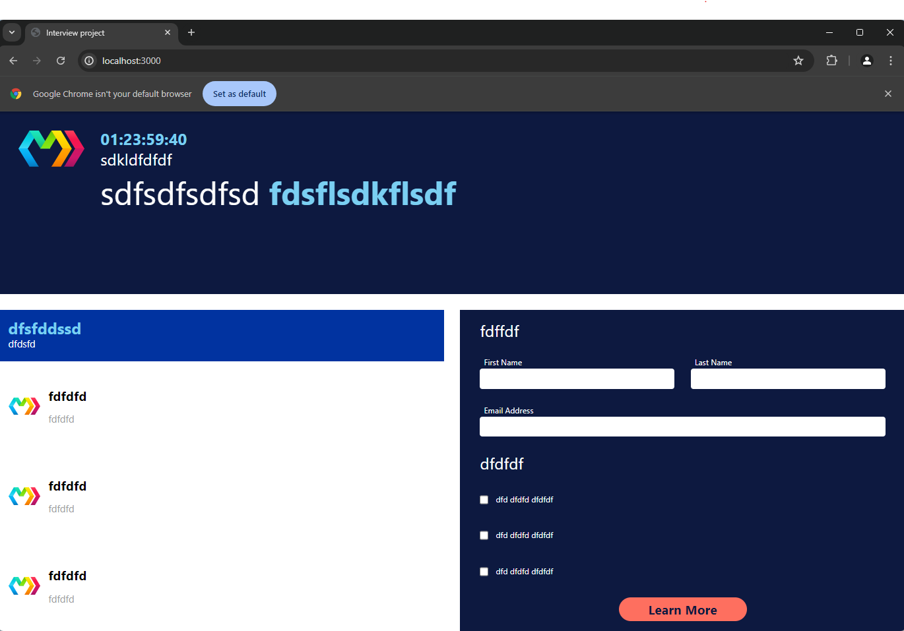
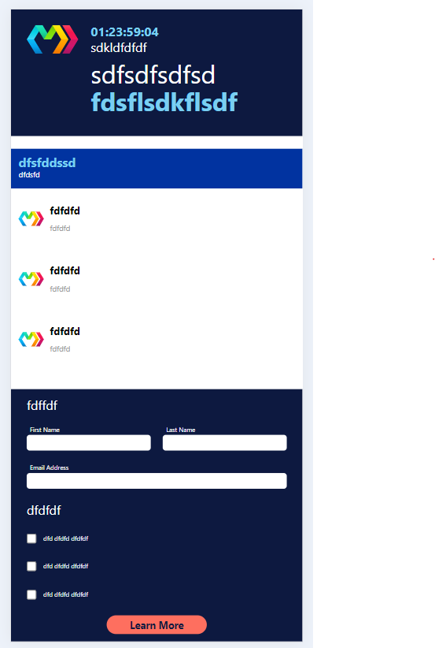

# Thanks for checking 

# Description
This project is an interview test project by using MarkoJs.

**Implementation details:**
- Countdown time defaults to 2 days.
- When the window width is less than 800px, the modules will be aligned vertically.

# Screenshots
**window size >= 800px:**

**window size < 800px:**

